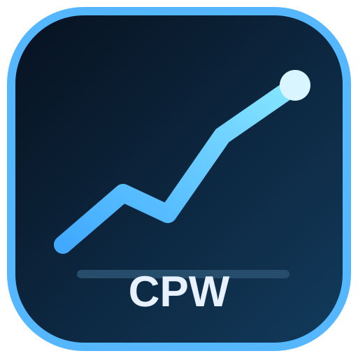

<div align="center">



# Crypto Price Widget v6.2

### Fast, modern desktop cryptocurrency monitoring powered by CoinGecko

**Python 3.10-3.14 • PySide6 / Qt 6 • PL / EN / NO • Background Refresh • Search • Pinned Assets • Animated Ticker • Windows EXE**

</div>

## Why v6.2 exists

The v6 modernization replaced the old `v1.py` through `v5.py` scripts with one maintainable application. A second regression audit found two important compatibility gaps: the classic project existed in both Polish and English forms, while the modern UI had become English-only, and an intentionally empty watch list could not survive a restart because it was silently replaced by the default Bitcoin/Ethereum list.

v6.2 fixes both issues and also strengthens Windows release validation by starting a real Qt window from both source and the packaged EXE before a release can be published.

The historical repository is named `CyptoPriceWidget`; the application itself uses the corrected **Crypto Price Widget** branding.

## Features

- live CoinGecko prices and 24-hour percentage change
- searchable asset catalog by coin name, symbol or CoinGecko ID
- up to 50 pinned assets, including a fully valid empty watch list
- restored animated compact price ticker inspired by the classic v3-v5 typewriter display
- one-time migration of legacy `pinned_tokens.json` when modern settings do not yet exist
- **automatic system-language mode plus manual EN / PL / NO selection**
- restored Polish labels from the classic application while retaining English support
- USD, EUR, GBP, NOK and PLN display currencies
- selectable refresh interval: 20, 30, 40, 60, 120 or 300 seconds
- classic 40-second refresh cadence as the modern default
- automatic background refresh without freezing the GUI
- resilient HTTPS requests with explicit timeouts and retries for temporary failures and rate limits
- persistent per-user settings via the platform application-data directory
- Pin and Unpin controls plus manual Refresh
- compact dark-blue Windows 11-friendly interface
- custom application icon displayed above, used by the GUI and embedded in the Windows EXE
- `by Swir` GitHub footer
- official Qt for Python bindings (PySide6)
- automated tests on Python 3.10, 3.11, 3.12, 3.13 and 3.14
- Windows source-GUI smoke test in CI
- packaged-EXE GUI smoke test before publication
- automated Windows EXE + portable ZIP + SHA256 release pipeline

## Upgrade from v1-v5

Older releases kept the watch list in a `pinned_tokens.json` file beside the program. On first modern start, if the per-user settings file does not exist and a valid `pinned_tokens.json` is present in the working directory, the app imports those coin IDs. Duplicates and blank entries are cleaned automatically. A broken legacy file is ignored rather than preventing startup.

After successful migration the modern settings file becomes authoritative; the old file is not modified.

The older project also shipped separate Polish and English scripts. v6.2 replaces those duplicated codebases with one translation layer. `AUTO` follows the system language where supported and falls back to English. PL, EN and NO can also be selected directly in the application.

## Run from source

```bash
git clone https://github.com/Swir/CyptoPriceWidget.git
cd CyptoPriceWidget
python -m venv .venv
.venv\Scripts\activate
python -m pip install -e .
python main.py
```

On Linux/macOS, activate the virtual environment using the platform-appropriate command.

For an offline GUI startup verification that does not call CoinGecko:

```bash
python main.py --smoke-gui
```

## Settings

Pinned assets, currency, refresh interval and language preference are saved outside the repository using the operating system's application-data location. This keeps personal state out of Git and lets a packaged EXE update without overwriting preferences.

Supported display currencies: **USD, EUR, GBP, NOK, PLN**. The default refresh interval is **40 seconds**, matching the useful cadence from the classic v5 widget while still enforcing a minimum of 20 seconds to reduce unnecessary API pressure.

## Development

```bash
python -m pip install -e ".[dev]"
pytest
python main.py --smoke-gui
python tools/build_icon.py
```

Regression coverage includes price formatting, ticker summaries, legacy pinned-token migration, empty-watch-list persistence, language resolution, settings sanitization and model parsing.

Project layout:

```text
src/crypto_price_widget/   application package
assets/                    source artwork shown in this README and used for the app icon
tests/                     unit and regression tests
tools/build_icon.py        PNG/ICO generator
.github/workflows/         CI and Windows release automation
main.py                    application entry point
```

## Releases

Numbered releases contain:

- `CryptoPriceWidget.exe`
- `CryptoPriceWidget-vX.Y.Z-Windows-x64.zip`
- SHA256 checksum files for both downloads

The release pipeline runs unit tests, starts the Qt GUI offscreen, generates the Windows ICO, builds the executable, checks `--version`, starts the **packaged GUI itself** offscreen, and only then publishes the release.

## Market-data disclaimer

Prices can be delayed, unavailable or rate-limited by the upstream provider. Crypto Price Widget is an informational monitor only; it does not execute trades and does not provide financial or investment advice.

## Author

Developed by **Swir** — https://github.com/Swir
