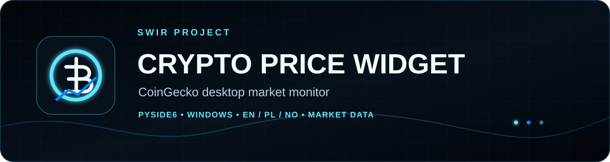
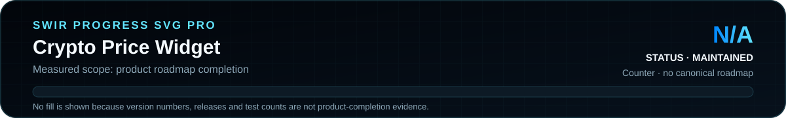
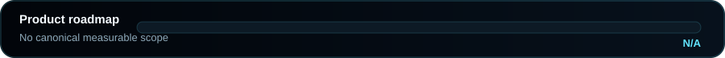

<!-- SWIR-README-STANDARD:v2 -->

<div align="center">



<br>


[](https://github.com/Swir)
[](https://github.com/Swir/CyptoPriceWidget/stargazers)

<br>

[**Highlights**](#-highlights) · [**Quick Start**](#-quick-start) · [**Progress**](#-progress) · [**Releases**](#-releases)

</div>

# Crypto Price Widget

A desktop cryptocurrency price monitor powered by CoinGecko, with searchable assets, pinned watch lists, background refresh, multilingual UI and a packaged Windows build.


## 📍 Project Status

<p align="center">
  
</p>

| Item | Status |
|---|---|
| Current stage | Maintained v6.x desktop utility |
| Application version | **6.2.0** |
| Main platform | Windows; source can run where PySide6 is supported |
| Latest public release | [v6.2.0](https://github.com/Swir/CyptoPriceWidget/releases/tag/v6.2.0) |
| Product progress | **N/A** — no authoritative measurable roadmap exists |

## 🚀 Overview

The v6 line replaced the historical `v1.py`–`v5.py` scripts with one maintainable PySide6 application. v6.2 restores multilingual behavior, preserves intentionally empty watch lists and strengthens GUI validation while keeping the classic ticker and legacy pinned-token migration path.

The repository name remains `CyptoPriceWidget`; the application branding is **Crypto Price Widget**.

## ✨ Highlights

| Feature | What it does |
|---|---|
| 📈 Live market data | Reads CoinGecko prices and 24-hour percentage change |
| 🔎 Asset search | Finds assets by name, symbol or CoinGecko ID |
| 📌 Watch list | Supports up to 50 pinned assets, including an intentionally empty list |
| 📰 Classic ticker | Shows the restored compact animated price ticker |
| 🌍 Languages | `AUTO`, English, Polish and Norwegian UI modes |
| 💱 Currencies | USD, EUR, GBP, NOK and PLN display currencies |
| ⏱️ Refresh control | 20, 30, 40, 60, 120 or 300 second intervals; 40 seconds is the default |
| 💾 Settings | Stores user preferences in the operating system application-data location |
| 🪟 Windows packaging | Release pipeline produces EXE, portable ZIP and SHA-256 files |
| 🧪 Validation | Python 3.10–3.14 tests plus source and packaged Qt GUI smoke checks |

## ⚙️ Quick Start

### Recommended — Windows release

Download the current files from [GitHub Releases](https://github.com/Swir/CyptoPriceWidget/releases/latest). v6.2.0 provides `CryptoPriceWidget.exe`, a Windows x64 portable ZIP and checksum files.

### From source

```bash
git clone https://github.com/Swir/CyptoPriceWidget.git
cd CyptoPriceWidget
python -m venv .venv
.venv\Scripts\activate
python -m pip install -e .
python main.py
```

On Linux/macOS, use the platform-appropriate virtual-environment activation command.

Offline GUI startup check:

```bash
python main.py --smoke-gui
```

## 📋 Requirements / Compatibility

- Python **3.10–3.14** according to the package metadata and CI matrix
- PySide6 / Qt 6
- Internet access for live CoinGecko data
- Windows x64 for the published EXE/portable release
- Other desktop platforms may run from source when the required Python/Qt stack is available; no packaged non-Windows release is currently published

## 🎮 Usage / Workflow

Search for an asset, pin the coins you want to monitor, choose a display currency and refresh interval, then use manual or automatic refresh. The selected watch list, currency, interval and language are persisted outside the repository.

Older installations may contain `pinned_tokens.json`. If modern settings do not yet exist, the application can import that legacy watch list once; invalid legacy data is ignored rather than blocking startup.

## 🧠 Technology / Architecture

| Layer | Technology / role |
|---|---|
| Desktop UI | PySide6 / Qt 6 |
| Market data | CoinGecko HTTPS API client with timeouts/retries |
| Settings | Per-user application-data storage plus legacy watch-list migration |
| Tests | pytest + compile checks + Qt GUI smoke tests |
| Packaging | PyInstaller Windows one-file build through GitHub Actions |

## 🗺️ Progress

<p align="center">
  
</p>

**Measured scope:** product-roadmap completion. **Result:** **N/A** because the repository does not define an authoritative checklist or weighted roadmap from which a trustworthy product-completion percentage can be calculated. Release version, test count and CI success are not used as a substitute.

## 📦 Releases

Latest verified public release: **v6.2.0**. The release contains:

- `CryptoPriceWidget.exe`
- `CryptoPriceWidget-v6.2.0-Windows-x64.zip`
- SHA-256 checksum files

[**Open GitHub Releases →**](https://github.com/Swir/CyptoPriceWidget/releases)

## 🧪 Development

```bash
python -m pip install -e ".[dev]"
pytest
python main.py --smoke-gui
python tools/build_icon.py
```

Regression coverage includes price formatting, ticker summaries, legacy watch-list migration, empty-watch-list persistence, language resolution, settings sanitization and model parsing.

## ⚠️ Limitations / Market-data disclaimer

- Market prices can be delayed, unavailable or rate-limited by the upstream provider.
- The application monitors market information only; it does not execute trades and is not financial or investment advice.
- A repository license file is not currently present; review the repository terms before redistributing modified copies.

## 🔎 Search Keywords

`crypto price widget` • `cryptocurrency desktop monitor` • `CoinGecko price tracker` • `PySide6 crypto app` • `Qt cryptocurrency widget` • `Windows crypto price monitor` • `Python market data GUI` • `crypto watch list desktop` • `multilingual crypto tracker` • `NOK PLN crypto prices` • `portable crypto monitor` • `CoinGecko desktop app`


<div align="center">

### `TRACK • VERIFY • PACKAGE • EVOLVE`

⭐ **If this project is useful, consider leaving a star.**

[**← SWIR profile**](https://github.com/Swir) · [**All projects →**](https://github.com/Swir?tab=repositories)

</div>
